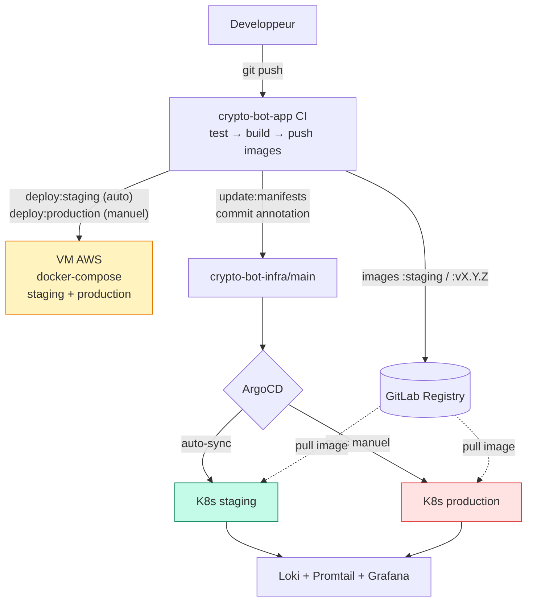
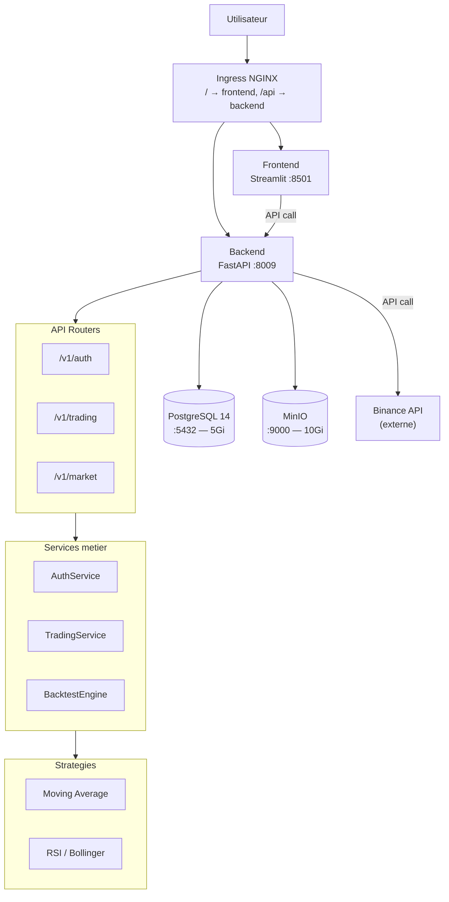
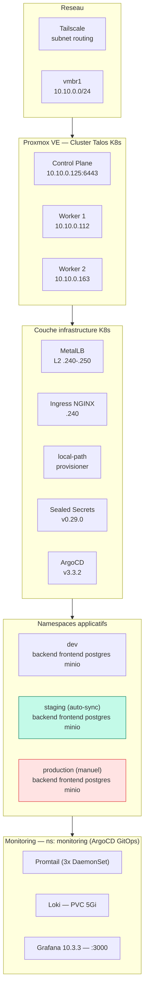

# Architecture Crypto-Bot

## 1. Contexte et objectifs

### Situation actuelle

- Backend FastAPI (:8009) + Frontend Streamlit (:8501)
- BDD : PostgreSQL 14, MinIO (S3-compatible)
- Infra : cluster Kubernetes (Talos) sur le serveur Proxmox — staging et
  production tournent en namespaces separes, deployees via GitOps ArgoCD
  (voir §5)
- CI/CD : GitLab CI (lint > test > build > update:manifests → ArgoCD sync)
- VM AWS Liora : reverse proxy + backups off-site + fallback
  docker-compose (bascule uniquement si le Proxmox tombe, voir §5)
- Registry : GitLab Container Registry (`registry.gitlab.com/dst_crypto/crypto-bot-app`)

> **Avant la migration K8s** (contexte historique) : l'application tournait
> entierement en Docker Compose sur la VM AWS, staging (:8009/:8501) et
> production (:9009/:8502) sur la meme machine, deploiement CI via SSH.
> C'est ce constat de depart (VM unique, pas de redondance, SSH deploy) qui
> a motive l'analyse comparative ci-dessous.

### Materiel disponible

| Ressource | Specs | Role |
|-----------|-------|------|
| **Serveur Proxmox (P1)** | 64 GB RAM, 512 GB SSD | Cluster K8s complet |
| VM AWS Liora | 2 vCPU, 7.6 GB RAM, 29 GB | Reverse proxy + fallback |
| Dell Inspiron 5515 | 16 GB RAM | Dev local |

### Contraintes

| Contrainte | Impact |
|------------|--------|
| Proxmox derriere le NAT de la box internet | Pas d'IP publique → tunnel outbound-only (Tailscale) |
| VM AWS : 8.9 GB disque libre | Role minimal : reverse proxy + backups |
| Equipe projet | Doivent acceder a l'app via Cloudflare Tunnel |

### Objectifs

1. **Redondance** : cluster K8s 3 noeuds + fallback docker-compose sur VM AWS
2. **Competences K8s/Talos** : montrer une maitrise Kubernetes en soutenance
3. **GitOps** : pipeline CI/CD moderne avec ArgoCD (staging auto, prod manuelle)
4. **Disponibilite equipe** : acces via Cloudflare Tunnel + fallback VM AWS
5. **Optimisation des couts** : ~7 EUR/mois vs ~283 EUR/mois full cloud (97.5% economie)
6. **Reproductibilite** : infra entierement reconstruisible depuis Git (GitOps)
7. **Securisation** : bridge isole, RBAC, Sealed Secrets, zero port entrant

---

## 2. Analyse comparative des architectures

Trois approches ont ete evaluees avant de choisir l'architecture finale.

### Option A : Tout sur PC perso (proposition initiale)

```
VM AWS = simple fallback docker-compose (inchangee)
PC     = cluster Talos (1 CP + 2 workers), staging + prod en namespaces
```

| Avantage | Inconvenient |
|----------|-------------|
| Simple a mettre en place | PC eteint = cluster K8s inaccessible |
| Pas de probleme reseau | VM AWS sous-utilisee |
| Tout en local | Equipe ne peut pas acceder au cluster |

### Option B : VM AWS comme control plane CI/CD

```
VM AWS = GitLab Runner + ArgoCD (dans Docker)
PC     = 2 clusters Talos separes (staging + prod)
```

| Avantage | Inconvenient |
|----------|-------------|
| VM AWS valorisee | Necessite sudo/root (PAS DISPO) |
| 2 clusters = impressionnant | ArgoCD sur VM doit joindre le PC derriere NAT |
| | `argocd app sync` = push model, PAS du vrai GitOps |

**Vrai GitOps (pull) vs faux GitOps (push) :**

```
PUSH : CI execute "argocd app sync" → deploie
       Si le CI est casse, on ne peut plus deployer.
       Git n'est pas la source de verite.

PULL (notre choix) : CI commit un tag image dans le repo infra
                     ArgoCD surveille le repo en permanence
                     ArgoCD detecte le changement et sync tout seul
                     Git EST la source de verite
```

### Option C retenue : Architecture hybride on-premise + cloud

```
Serveur Proxmox (64 GB)  → Cluster Talos K8s complet (staging + prod)
VM AWS (7.6 GB)           → Reverse proxy + backups off-site + fallback docker-compose
```

L'equipe accede a l'app via Cloudflare Tunnel (outbound-only depuis le Proxmox).
Si le Proxmox tombe, la VM AWS bascule automatiquement sur docker-compose
avec les derniers backups DB (max 6h de retard).

Grace au GitOps, le cluster est recree en 30 minutes depuis Git.
Cout total : ~7 EUR/mois vs ~283 EUR/mois en full cloud AWS.

---

## 3. Hardware et budget

### VMs sur Proxmox

| VM | Role | vCPU | RAM | Disque |
|----|------|------|-----|--------|
| talos-cp1 | Control Plane + etcd | 4 | 8 GB | 60 GB |
| talos-worker1 | Worker (staging) | 6 | 20 GB | 150 GB |
| talos-worker2 | Worker (prod) | 6 | 20 GB | 150 GB |

Budget RAM : 52 GB alloues sur 64 GB (~12 GB spare).

### Comparatif des couts

```
FULL CLOUD AWS                    ARCHITECTURE HYBRIDE (notre choix)
─────────────                     ──────────────────────────────────
EKS control plane    ~73 EUR      Serveur Proxmox      0 EUR (amorti)
3x EC2 t3.medium     ~90 EUR      Electricite serveur   ~3 EUR
RDS PostgreSQL       ~30 EUR      VM AWS minimale       ~4 EUR
DocumentDB           ~60 EUR      Cloudflare Tunnel     0 EUR (free tier)
ALB                  ~20 EUR      Tailscale             0 EUR (free tier)
EBS 100 GB           ~10 EUR
─────────────────────────         ──────────────────────────────────
Total : ~283 EUR/mois             Total : ~7 EUR/mois
        ~3 400 EUR/an                     ~84 EUR/an
                                  Economie : 97.5%
```

---

## 4. Securisation et acces

### Isolation reseau

```
Reseau domestique (LAN)
    │
    ├── Proxmox host (interface management, vmbr0)
    │
    └── Bridge isole K8s (vmbr1) ← AUCUN acces au LAN
         ├── VM talos-cp1      (8 GB)
         ├── VM talos-worker1  (20 GB)
         └── VM talos-worker2  (20 GB)
              │
              └── Tunnel sortant uniquement → VM AWS / Cloudflare
```

- VMs K8s sur un bridge dedie (`vmbr1`), **isole du reste du LAN**
- **Zero port entrant** sur la box internet
- Tunnel outbound-only (Cloudflare Tunnel ou WireGuard)

### Controle d'acces par couche

| Couche | Mecanisme |
|--------|-----------|
| Proxmox host | SSH par cle uniquement |
| Kubernetes API | RBAC : roles par namespace |
| ArgoCD | Authentification + roles |
| Secrets | Sealed Secrets : chiffres dans Git |
| Containers | Execution non-root |
| Images | Pull depuis GitLab Registry (prive) |
| Bases de donnees | ClusterIP uniquement (jamais exposees) |

### Acces equipe vs admin

| | Equipe (devs) | Admins (ops) |
|--|---------------|--------------|
| Via | Cloudflare Tunnel | Tailscale VPN |
| Installe | Rien (navigateur) | Tailscale client |
| Acces | App staging/prod | kubectl, ArgoCD, Grafana |

---

## 5. Architecture cible

### Vue globale — Flux GitOps



> Le cluster K8s (via ArgoCD, GitOps pull-based) est la cible principale.
> La VM AWS recoit un deploiement direct (SSH) a chaque release, ce qui la
> maintient a jour en permanence pour servir de bascule immediate si le
> Proxmox tombe (voir mecanisme de fallback ci-dessous).

### Architecture applicative



### Infrastructure Kubernetes



### Mecanisme de fallback

```
FONCTIONNEMENT NORMAL :
  Utilisateur → VM AWS (Nginx) → Tunnel → K8s (Proxmox)

SI LE PROXMOX TOMBE :
  1. Nginx detecte le tunnel mort (health check)
  2. Restauration des derniers backups DB (max 6h)
  3. docker-compose up sur la VM AWS
  4. Nginx bascule vers localhost
  → L'application est de nouveau accessible en ~2 min

RETOUR A LA NORMALE :
  1. Proxmox redmarre, tunnel se retablit
  2. Nginx re-bascule vers le cluster K8s
  3. docker-compose down sur la VM AWS

GARANTIES :
  RPO (perte de donnees max) : 6h (intervalle configurable)
  RTO (temps de bascule)     : ~2 min (manuel) / ~30s (automatise)
```

### GitOps avec ArgoCD

Le deploiement suit un modele **pull-based** (vrai GitOps) : le CI ne deploie jamais directement sur le cluster. Git est la source de verite.

```
PUSH sur staging
  → GitLab CI : test → build:docker → update:manifests
    → Commit "ci(gitops): staging rollout <sha>" dans crypto-bot-infra/main
    → ArgoCD detecte le changement (polling 3 min)
    → Auto-sync → rolling update backend + frontend

TAG vX.X
  → GitLab CI : test → build:docker → update:manifests
    → Commit "ci(gitops): production vX.X (<sha>)" dans crypto-bot-infra/main
    → ArgoCD affiche OutOfSync
    → Sync manuel → rolling update
```

**Mecanisme** : le tag image staging est fixe (`:staging`), donc un simple push d'image ne produit aucun diff dans les manifests. Le job `update:manifests` ajoute une annotation `deployed-commit: "<sha>"` dans le pod template. Ce changement est detecte par ArgoCD et declenche un rolling update.

| Application ArgoCD | Namespace | Sync | Strategie |
|-------------------|-----------|------|-----------|
| `crypto-bot-staging` | staging | **Auto-sync** + prune + selfHeal | Chaque commit CI declenche un rollout |
| `crypto-bot-production` | production | **Manuel** | Review avant sync, tag versionne |
| `monitoring` | monitoring | **Auto-sync** | Helm loki-stack + dashboards Grafana |

Le namespace `dev` n'est pas gere par ArgoCD — deploiement manuel via `dev-deploy.sh`.

### Choix technologiques

| Composant | Choix | Justification |
|-----------|-------|---------------|
| OS K8s | **Talos Linux** | Immutable, securise, API-driven, pas de SSH |
| Hyperviseur | **Proxmox VE** | Interface web, snapshots, KVM natif |
| Overlay network | **Flannel** (defaut Talos) | Simple, integre a Talos. **Ne supporte pas les NetworkPolicies** sans policy controller additionnel (Calico, Kube-Router). Les manifests NetworkPolicy sont deployes (intention documentee) mais non enforces tant qu'un policy controller n'est pas installe. |
| LoadBalancer | **MetalLB** | IPs LoadBalancer sur bare-metal |
| Ingress | **NGINX Ingress Controller** | Standard, bien documente |
| GitOps | **ArgoCD** | Reference GitOps pull-based, UI web |
| Manifests | **Kustomize** | Natif kubectl, base + overlays |
| Storage | **local-path-provisioner** | PVs sur disque local des workers |
| Secrets | **Sealed Secrets** | Chiffres dans Git, dechiffres dans le cluster |
| Monitoring | **Loki + Promtail + Grafana** | Logs centralises (Helm chart loki-stack v2.10.3) |
| Acces equipe | **Cloudflare Tunnel** | Outbound-only, zero port entrant, free tier |
| Acces admin | **Tailscale** | Mesh VPN gratuit, traverse NAT |
| VM AWS | **Nginx + docker-compose** | Reverse proxy + resilience |
| Backups | **CronJob K8s** | pg_dump toutes les 6h vers VM AWS |

### Pourquoi 3 VMs Talos sur 1 seul serveur physique

```
1 serveur physique + Talos bare-metal = 1 seul noeud Kubernetes

Mais on veut 3 noeuds (1 CP + 2 workers) sur 1 machine.
→ Proxmox cree 3 VMs, chaque VM boot sur Talos ISO.
→ Chaque VM = un noeud K8s independant.
```

Proxmox agit comme hyperviseur : chaque VM Talos est un noeud K8s a part
entiere (isolation memoire/CPU/disque via KVM), ce qui permet de simuler un
vrai cluster multi-noeuds sur un seul serveur.

---

## 6. Points de soutenance

### Narrative recommandee

> "Nous avons une architecture hybride on-premise + cloud :
> - Un cluster Kubernetes Talos OS sur un serveur Proxmox heberge
>   staging et production avec un workflow GitOps ArgoCD.
> - Une VM AWS sert de point d'entree (reverse proxy) et de filet
>   de securite : en cas de panne du serveur, un fallback docker-compose
>   prend le relais avec les derniers backups (RPO 6h, RTO 2 min).
> - L'equipe accede a l'application via Cloudflare Tunnel, sans aucun
>   port ouvert sur la box internet.
> - L'infrastructure est entierement reproductible depuis Git : on peut
>   recreer le cluster en 30 minutes, ArgoCD redeploie tout (voir INSTALL.md).
> - Cette architecture offre la meme resilience qu'un full cloud AWS
>   pour 97.5% moins cher (~7 EUR/mois vs ~283 EUR/mois)."

### Points techniques a mettre en avant

1. **Talos OS** : OS immutable, pas de SSH, gestion 100% API = securite renforcee
2. **GitOps pull-based** : ArgoCD surveille Git et reconcilie (pas de push depuis le CI)
3. **Kustomize** : meme base de manifests, overlays par environnement
4. **Architecture hybride** : K8s on-premise + cloud minimal (reverse proxy + backups)
5. **Fallback automatise** : docker-compose sur VM AWS avec backups toutes les 6h
6. **Infra reproductible** : cluster jetable, Git est la source de verite
7. **Resilience** : 2 workers K8s, pods reschedulables, fallback cloud
8. **Securisation** : bridge isole, RBAC, Sealed Secrets, Cloudflare Tunnel, zero port entrant
9. **Monitoring** : Loki + Promtail + Grafana pour les logs centralises de tous les pods
10. **Optimisation des couts** : 97.5% d'economie vs full cloud AWS
