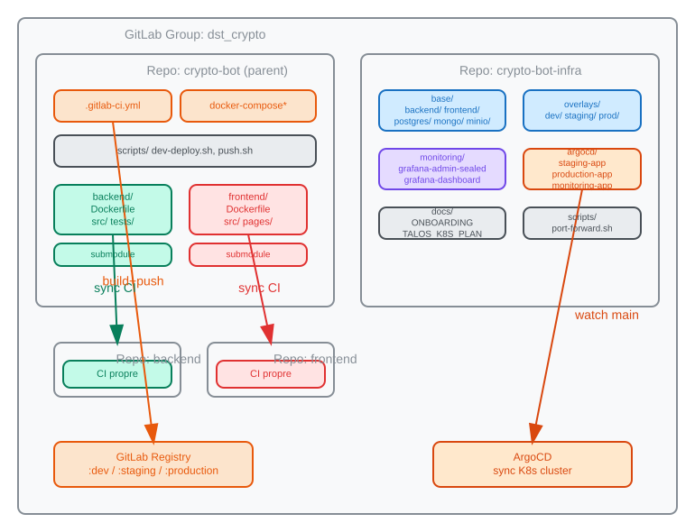
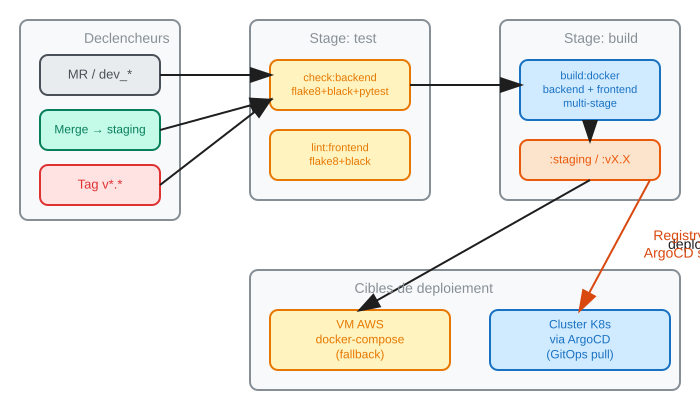
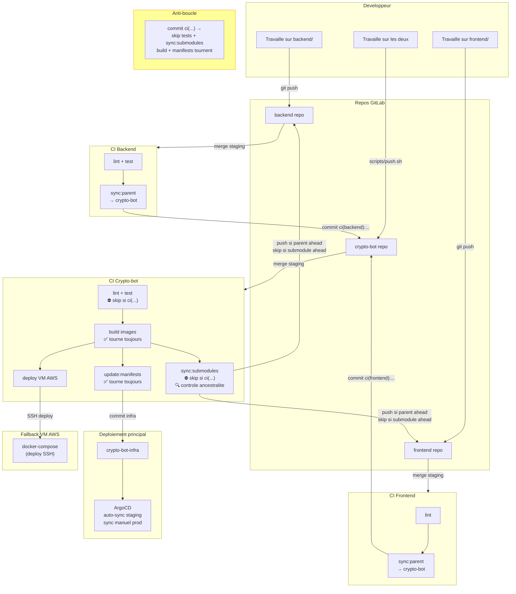
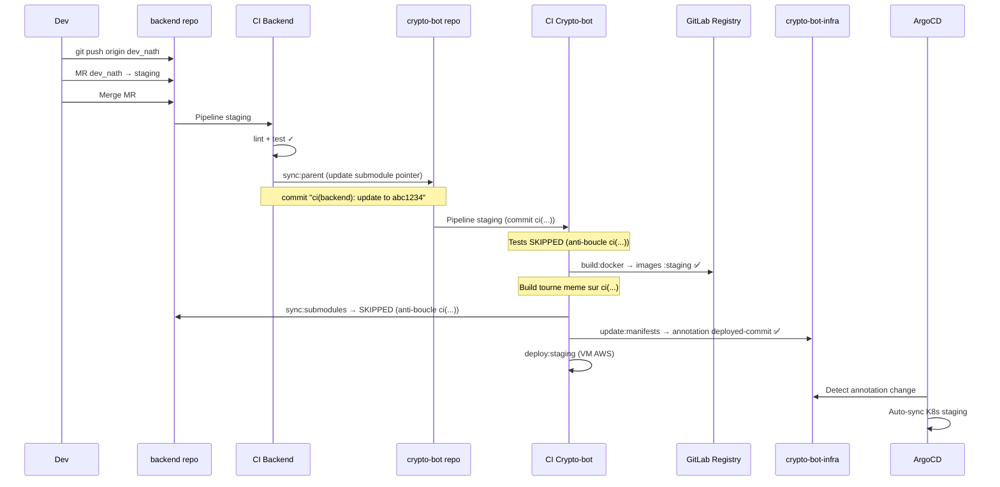
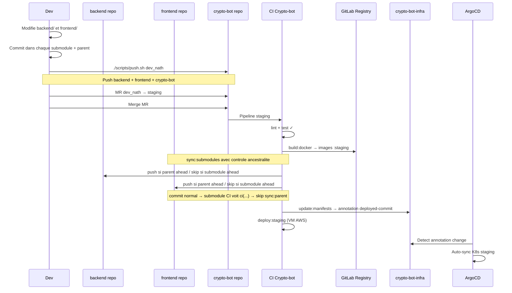
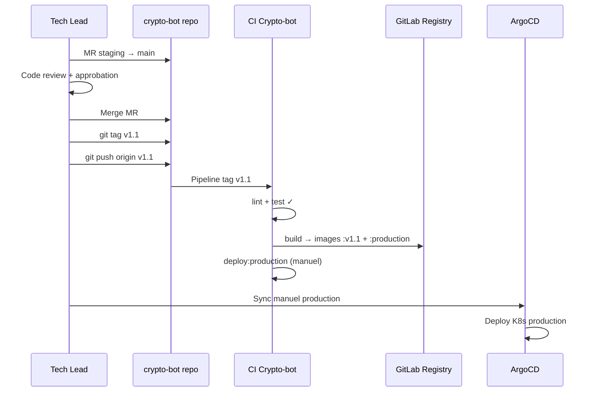

# Git Workflow - Crypto-Bot

Sync bidirectionnel entre les 3 repos applicatifs.

## Organisation des repos



| Repo | Contenu | CI |
|------|---------|-----|
| **crypto-bot** | Orchestration, docker-compose, CI principal, scripts | Test + Build + Sync submodules + Deploy |
| **backend** | Code FastAPI (submodule de crypto-bot) | Test + Sync parent |
| **frontend** | Code Streamlit (submodule de crypto-bot) | Lint + Sync parent |
| **crypto-bot-infra** | Manifests K8s (Kustomize, ArgoCD) | Pas de CI (ArgoCD pull) |

## Pipeline CI/CD



## Branches

| Branche | Role | Protection |
|---------|------|------------|
| `feature/*`, `dev_*` | Travail quotidien | Aucune |
| `staging` | Integration / test | MR requise, 0 approbation |
| `main` | Production | MR requise, 1+ approbation |

Les 3 repos app (crypto-bot, backend, frontend) ont les **memes branches**.
Le CI les synchronise automatiquement.


## Diagramme global




## Flux detaille : staging

### Cas A — Dev travaille sur un seul composant (ex: backend)



> **Flux identique pour le frontend** : MR sur frontend → `sync:parent` → crypto-bot CI → build → deploy

### Cas B — Dev travaille sur les deux (backend + frontend)



### Cas C — Passage en production




## Anti-boucle

Le mecanisme qui empeche les boucles infinies sans bloquer le build :

```
Sens montant : backend merge staging
  → CI sync:parent → commit "ci(backend):..." sur crypto-bot staging
  → crypto-bot CI declenche :
      ⛔ tests SKIP          (commit ci(...))
      ✅ build:docker TOURNE (images :staging)
      ⛔ sync:submodules SKIP (commit ci(...)) → PAS de re-push → STOP ✓
      ✅ update:manifests TOURNE (annotation → ArgoCD sync)
      ✅ deploy:staging TOURNE (VM AWS)

Sens descendant : crypto-bot merge staging (commit normal)
  → CI sync:submodules → controle ancestralite :
      Si submodule ahead → SKIP (ne pas ecraser)
      Si parent ahead → push normal (pas de force-push)
  → push cree un commit sur backend/frontend staging
  → submodule CI declenche → sync:parent → commit "ci(...):" sur crypto-bot
  → crypto-bot CI → voit ci(...) → sync:submodules SKIP → STOP ✓
```

**Regle par job** (commit `ci(`) :

| Job | Skip sur `ci(` ? | Raison |
|-----|------------------|--------|
| `check:backend` | Oui | Deja teste dans le submodule |
| `lint:frontend` | Oui | Deja teste dans le submodule |
| `build:docker` | **Non** | Doit construire les nouvelles images |
| `sync:submodules` | Oui | Empeche la boucle infinie |
| `update:manifests` | **Non** | Doit mettre a jour ArgoCD |
| `deploy:staging` | **Non** | Doit deployer sur VM AWS |

### Controle d'ancestralite (sync:submodules)

Avant de push vers un submodule, `sync:submodules` verifie :

```
1. SHA identique      → "Already up to date" → skip
2. Submodule en avance → "AHEAD, skipping"    → skip (ne pas ecraser une MR mergee)
3. Parent en avance    → push normal           → PAS de --force
4. Push echoue         → warning               → intervention manuelle requise
```


## Quand utiliser scripts/push.sh

| Situation | Commande | Pourquoi |
|-----------|----------|----------|
| Travail sur **backend** uniquement | `cd backend && git push` | Le sync:parent met a jour crypto-bot |
| Travail sur **frontend** uniquement | `cd frontend && git push` | Le sync:parent met a jour crypto-bot |
| Travail sur **les deux** depuis crypto-bot | `./scripts/push.sh` | Push les 3 repos d'un coup |
| Travail sur **CI/docker-compose** uniquement | `git push` | Pas de submodule a sync |


## Exemple concret : scripts/push.sh

Scenario : on a modifie le backend et le frontend depuis le repo crypto-bot.

```bash
# 1. On est dans crypto-bot/ sur la branche staging
cd ~/Crypto-bot
git checkout staging

# 2. Modifier le backend
cd backend
# ... editer des fichiers ...
git add .
git commit -m "feat: ajouter endpoint /v1/market/history"

# 3. Modifier le frontend
cd ../frontend
# ... editer des fichiers ...
git add .
git commit -m "feat: page historique marche"

# 4. Revenir au parent et commiter les references submodules
cd ..
git add backend frontend
git commit -m "feat: historique marche (backend + frontend)"

# 5. Tout pusher d'un coup avec push.sh
./scripts/push.sh staging
```

Ce que fait `push.sh` :
1. `cd backend && git push origin staging` (push le submodule d'abord)
2. `cd frontend && git push origin staging` (push le submodule d'abord)
3. `git push origin staging` (push le parent)

> **Pourquoi cet ordre ?** Si on pushait le parent en premier, la CI essaierait
> de sync les submodules mais les commits referencies n'existeraient pas encore
> sur le remote. En pushant les submodules d'abord, on s'assure que les SHA
> sont deja disponibles.


## Variables CI requises

### Variable de GROUPE (GitLab > Groupe dst_crypto > Settings > CI/CD > Variables)

| Variable | Valeur | Scope |
|----------|--------|-------|
| `GROUP_PAT_TOKEN` | PAT avec scopes `write_repository` + `read/write_registry` | Toutes branches |

> Un seul PAT, configure une seule fois au niveau du groupe.
> Accessible automatiquement par les 3 repos (backend, frontend, crypto-bot).

### Comment creer le GROUP_PAT_TOKEN

1. **Creer le PAT** : GitLab > Avatar (coin haut droit) > Edit profile > Access Tokens
   - Name : `group-ci-sync`
   - Expiration : 1 an max
   - Scopes : `write_repository`, `read_registry`, `write_registry`
   - Cliquer "Create personal access token"
   - **Copier le token** (commence par `glpat-`, affiche une seule fois)

2. **Ajouter comme variable de groupe** : GitLab > Groupe `dst_crypto` > Settings > CI/CD > Variables
   - Key : `GROUP_PAT_TOKEN`
   - Value : coller le PAT
   - Type : Variable
   - Protected : Non (sinon pas accessible sur staging)
   - Masked : Oui
   - Cliquer "Add variable"

> Le token est maintenant accessible dans les 3 repos (backend, frontend, crypto-bot)
> sans avoir a le configurer 3 fois.

### Variables supplementaires sur **crypto-bot** uniquement

| Variable | Valeur | Scope |
|----------|--------|-------|
| `SSH_PRIVATE_KEY` | Cle SSH pour deploy VM AWS | staging, prod |
| `VM_HOST` | `13.37.234.206` | staging, prod |
| `SSH_USER` | `ubuntu` | staging, prod |


## Protection des branches

### Sur les 3 repos (backend, frontend, crypto-bot)

| Branche | Push direct | MR | Approbations |
|---------|------------|-----|-------------|
| `staging` | Interdit (sauf CI token) | Oui | 0 (merge libre apres CI vert) |
| `main` | Interdit | Oui | 1 minimum |
