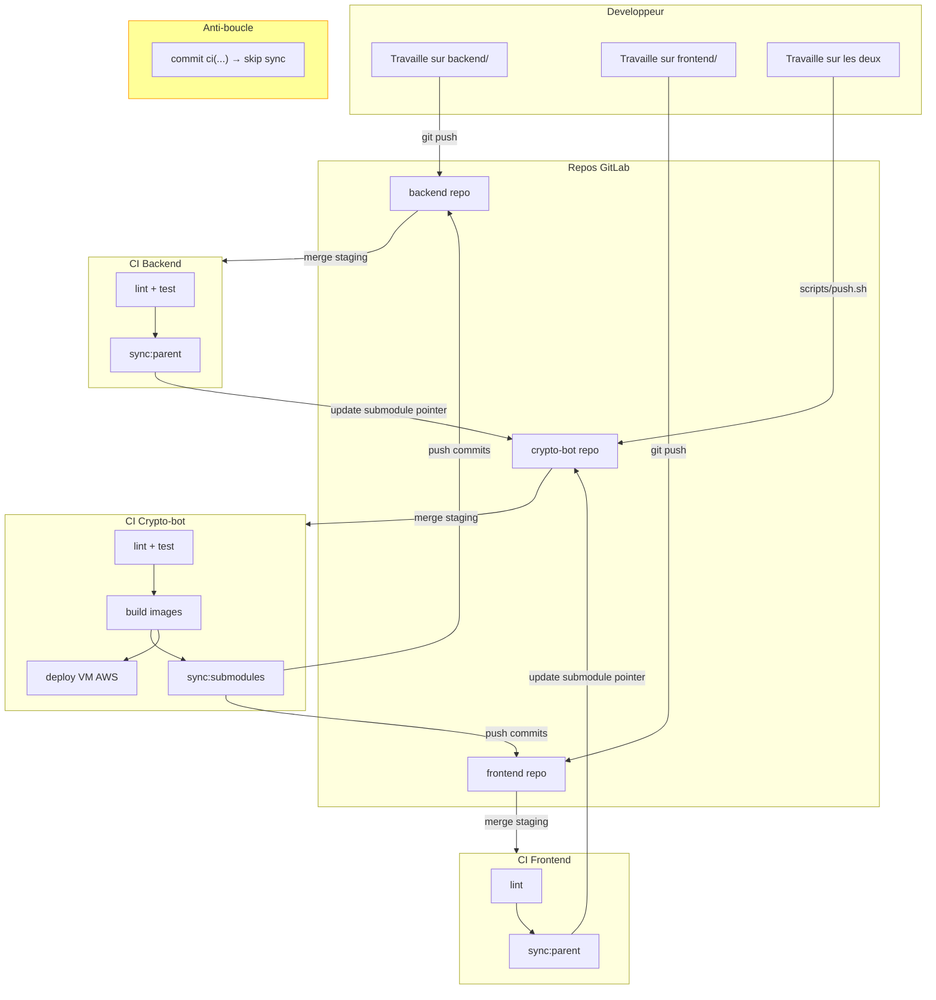
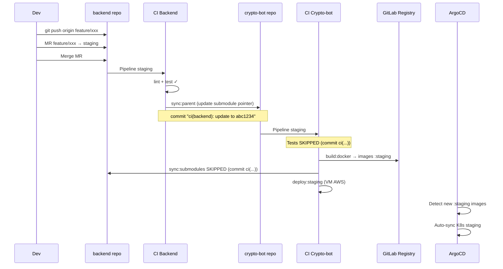
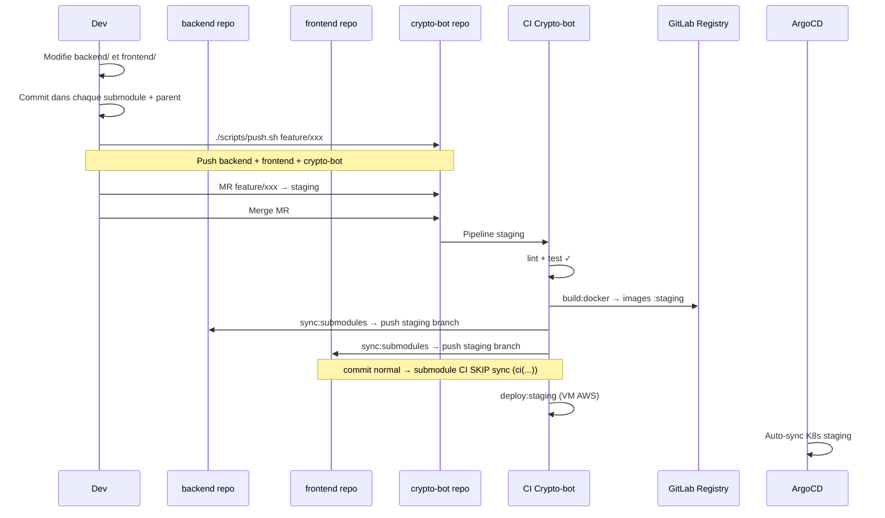
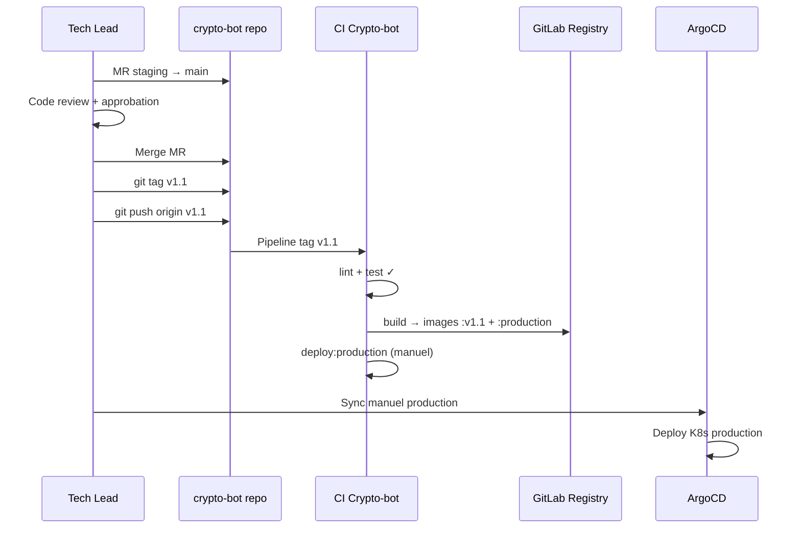

# Git Workflow - Crypto-Bot
# =========================
# Sync bidirectionnel entre les 3 repos applicatifs

## Repos

| Repo | Contenu | CI |
|------|---------|-----|
| **crypto-bot** | Orchestration, docker-compose, CI principal, scripts | Test + Build + Sync submodules + Deploy |
| **backend** | Code FastAPI (submodule de crypto-bot) | Test + Sync parent |
| **frontend** | Code Streamlit (submodule de crypto-bot) | Lint + Sync parent |
| **crypto-bot-infra** | Manifests K8s (Kustomize, ArgoCD) | Pas de CI (ArgoCD pull) |


## Branches

| Branche | Role | Protection |
|---------|------|------------|
| `feature/*`, `dev_*` | Travail quotidien | Aucune |
| `staging` | Integration / test | MR requise, 0 approbation |
| `main` | Production | MR requise, 1+ approbation |

Les 3 repos app (crypto-bot, backend, frontend) ont les **memes branches**.
Le CI les synchronise automatiquement.


## Diagramme global




## Flux detaille : staging

### Cas A — Dev travaille sur un seul composant (backend)



### Cas B — Dev travaille sur les deux (backend + frontend)



### Cas C — Passage en production




## Anti-boucle

Le mecanisme qui empeche les boucles infinies :

```
crypto-bot merge → CI sync:submodules → push "ci(sync):..." sur backend
    → backend CI declenche → voit "ci(" → SKIP sync:parent → STOP ✓

backend merge → CI sync:parent → push "ci(backend):..." sur crypto-bot
    → crypto-bot CI declenche → voit "ci(" → SKIP sync:submodules → STOP ✓
```

**Regle unique** : si `$CI_COMMIT_MESSAGE` commence par `ci(`, tous les jobs sync sont ignores.


## Quand utiliser scripts/push.sh

| Situation | Commande | Pourquoi |
|-----------|----------|----------|
| Travail sur **backend** uniquement | `cd backend && git push` | Le sync:parent met a jour crypto-bot |
| Travail sur **frontend** uniquement | `cd frontend && git push` | Le sync:parent met a jour crypto-bot |
| Travail sur **les deux** depuis crypto-bot | `./scripts/push.sh` | Push les 3 repos d'un coup |
| Travail sur **CI/docker-compose** uniquement | `git push` | Pas de submodule a sync |


## Variables CI requises

### Variable de GROUPE (GitLab > Groupe dst_crypto > Settings > CI/CD > Variables)

| Variable | Valeur | Scope |
|----------|--------|-------|
| `GROUP_PAT_TOKEN` | PAT avec scopes `write_repository` + `read/write_registry` | Toutes branches |

> Un seul PAT, configure une seule fois au niveau du groupe.
> Accessible automatiquement par les 3 repos (backend, frontend, crypto-bot).

### Variables supplementaires sur **crypto-bot** uniquement

| Variable | Valeur | Scope |
|----------|--------|-------|
| `SSH_PRIVATE_KEY` | Cle SSH pour deploy VM AWS | staging, prod |
| `VM_HOST` | `13.37.234.206` | staging, prod |
| `SSH_USER` | `ubuntu` | staging, prod |


## Protection des branches

### Sur les 3 repos (backend, frontend, crypto-bot)

| Branche | Push direct | MR | Approbations |
|---------|------------|-----|-------------|
| `staging` | Interdit (sauf CI token) | Oui | 0 (merge libre apres CI vert) |
| `main` | Interdit | Oui | 1 minimum |
