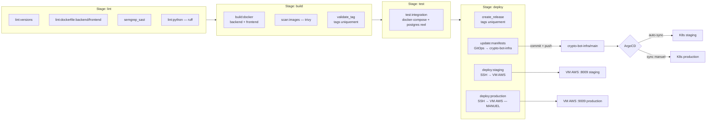

# Git Workflow — Crypto-Bot

> `crypto-bot-app` est un **monorepo** (backend + frontend dans le meme repo,
> plus de submodules). `crypto-bot-infra` reste un repo separe (manifests
> K8s), mis a jour automatiquement par la CI de `crypto-bot-app`.

## Organisation des repos

| Repo | Contenu | CI |
|------|---------|-----|
| **crypto-bot-app** | Backend FastAPI + Frontend Streamlit (monorepo), CI complet | lint → build → test → deploy |
| **crypto-bot-infra** | Manifests K8s (Kustomize, ArgoCD) | Pas de CI applicative (verify.sh en local, ArgoCD pull) |

## Branches

| Branche | Role | Pipeline declenche |
|---------|------|---------------------|
| `dev_*`, `feature/*` | Travail quotidien | Lint seul (pipeline complet si une MR est ouverte, evite les doublons) |
| `staging` | Integration / test | Pipeline complet : lint → build → test → deploy (auto, staging) |
| `main` | Miroir de release | **Aucun pipeline** — le deploiement se fait via un tag `vX.Y.Z` |

Flux standard : `feature/*` → MR vers `staging` (CI verte requise) → merge →
deploiement automatique staging → quand pret, MR `staging` → `main` (review +
approbation) → tag `vX.Y.Z` sur `main` → build + deploiement production
(manuel).

---

## Pipeline CI/CD



### Declencheurs par branche/evenement

| Evenement | lint | build | test | deploy |
|-----------|------|-------|------|--------|
| Push `dev_*`/`feature/*` (sans MR ouverte) | ✅ | — | — | — |
| MR ouverte (vers staging ou main) | ✅ | ✅ | ✅ | — |
| Push `staging` | ✅ | ✅ | ✅ | ✅ (staging, auto) |
| Tag `vX.Y.Z` | — | ✅ | ✅ | ✅ (production, **manuel**) |
| Push `main` | — | — | — | — (pas de pipeline) |

### Detail des jobs

**Lint** :
- `lint:versions` — verifie que `versions.env` (source unique des versions d'images) et les `variables:` du `.gitlab-ci.yml` sont synchronises
- `lint:dockerfile:backend` / `:frontend` — hadolint (bonnes pratiques Dockerfile)
- `semgrep_sast` — scan securite (injections, SSRF...), bloquant
- `lint:python` — ruff check + format (backend + frontend)

**Build** :
- `build:docker` — build backend (target `runtime` + `test`) et frontend, push vers le GitLab Registry. Tags selon le contexte (voir ci-dessous)
- `scan:images` — trivy, CVE CRITICAL bloquantes (non-fixables ignorees)
- `validate_tag` — verifie le format SemVer du tag (`vX.Y.Z` ou `vX.Y.Z-suffix`)

**Test** :
- `test:integration` — lance l'image Docker **buildee** (pas le code source) avec un vrai PostgreSQL via `docker-compose.test.yml`. Garantit qu'on teste exactement ce qui sera deploye. Rapports JUnit + coverage Cobertura.

**Deploy** :
- `create_release` — cree une GitLab Release sur tag
- `deploy:staging` / `stop:staging` — SSH vers la VM AWS, `docker compose -f docker-compose.staging.yml up -d`, health check `/health`. Automatique a chaque push staging.
- `deploy:production` / `stop:production` — idem sur `docker-compose.prod.yml`, avec backup DB avant deploiement. **Manuel**, declenche sur tag.
- `update:manifests` — met a jour `crypto-bot-infra/main` (voir ci-dessous), qui declenche ArgoCD

### Deux cibles de deploiement en parallele

Chaque release (push staging / tag production) deploie **a la fois** :

1. **VM AWS** (`deploy:staging`/`deploy:production`) — SSH direct + `docker compose up`, deploiement classique
2. **Cluster K8s** (`update:manifests` → ArgoCD) — vrai GitOps pull-based, source de verite = Git

`update:manifests` clone `crypto-bot-infra`, puis :

```bash
# Staging : annotation seule (le tag d'image :staging ne change pas)
sed -i 's/deployed-commit: ".*"/deployed-commit: "<sha>"/' overlays/staging/kustomization.yaml

# Production : tag versionne + annotation
sed -i "s|backend:.*|backend:<vX.Y.Z>|g" overlays/production/kustomization.yaml
sed -i 's/deployed-commit: ".*"/deployed-commit: "<sha>"/' overlays/production/kustomization.yaml

git commit -m "ci(gitops): ..." && git push origin main
```

ArgoCD detecte le changement dans `crypto-bot-infra` et synchronise (auto
pour staging, manuel pour production — voir [ARCHITECTURE.md](ARCHITECTURE.md) §5).

---

## Tags d'image Docker

| Contexte | Tags pousses |
|----------|--------------|
| MR (test) | `test-<pipeline_iid>` |
| Push `staging` | `staging`, `latest` |
| Tag `vX.Y.Z` | `vX.Y.Z`, `production`, `latest` |

---

## Variables CI requises

GitLab > `crypto-bot-app` > Settings > CI/CD > Variables :

| Variable | Usage | Scope |
|----------|-------|-------|
| `GROUP_PAT_TOKEN` | PAT `write_repository`, push vers `crypto-bot-infra` (job `update:manifests`) | Toutes branches |
| `SSH_PRIVATE_KEY` | Cle SSH pour deploy VM AWS | staging, tags |
| `VM_HOST` | IP/hostname de la VM AWS | staging, tags |
| `SSH_USER` | Utilisateur SSH sur la VM AWS | staging, tags |

`GROUP_PAT_TOKEN` : creer sur GitLab > Avatar > Edit profile > Access Tokens
(scope `write_repository`, expiration 1 an max), puis l'ajouter comme variable
de **groupe** `dst_crypto` (Protected: non, Masked: oui) pour qu'il soit
accessible sans duplication si d'autres repos en ont besoin.

---

## Protection des branches

| Branche | Push direct | MR | Approbations |
|---------|------------|-----|-------------|
| `staging` | Interdit (sauf CI token) | Oui | 0 (merge libre apres CI verte) |
| `main` | Interdit | Oui | 1 minimum |
