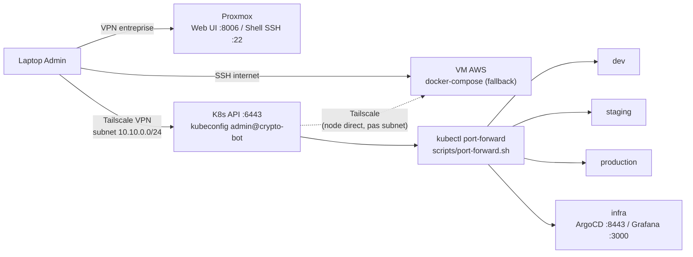

# Onboarding Equipe — Acces au Cluster Kubernetes

> Pour comprendre l'architecture globale du projet, voir [ARCHITECTURE.md](ARCHITECTURE.md).
> Pour reconstruire le cluster depuis zero (disaster recovery total), voir [INSTALL.md](INSTALL.md).

> Diagramme de l'infrastructure K8s : voir [ARCHITECTURE.md §5](ARCHITECTURE.md#5-architecture-cible).



> Detail des ports par environnement (frontend, backend, PostgreSQL, MinIO) :
> voir la table en fin de document, section "Acces aux services".

## Prerequis

Chaque membre de l'equipe doit installer **kubectl** et disposer du **kubeconfig** + acces SSH au Proxmox.

---

## 1. Installer kubectl

### Linux / WSL2

```bash
curl -LO "https://dl.k8s.io/release/$(curl -L -s https://dl.k8s.io/release/stable.txt)/bin/linux/amd64/kubectl"
chmod +x kubectl
sudo mv kubectl /usr/local/bin/
kubectl version --client
```

### macOS

```bash
# Avec Homebrew
brew install kubectl

# Ou manuellement (Apple Silicon)
curl -LO "https://dl.k8s.io/release/$(curl -L -s https://dl.k8s.io/release/stable.txt)/bin/darwin/arm64/kubectl"
chmod +x kubectl
sudo mv kubectl /usr/local/bin/
```

### Windows (PowerShell)

```powershell
# Avec Chocolatey
choco install kubernetes-cli

# Ou manuellement
curl.exe -LO "https://dl.k8s.io/release/v1.32.2/bin/windows/amd64/kubectl.exe"
# Deplacer kubectl.exe dans un dossier du PATH
```

---

## 2. Configurer l'acces SSH au Proxmox

Le cluster K8s tourne sur un reseau isole (10.10.0.0/24) derriere le serveur Proxmox.
Chaque membre a besoin d'un acces SSH au Proxmox (pour les taches admin). L'acces au cluster K8s se fait via **Tailscale** (voir section 3.2).

### 2.1 Generer une cle SSH (si pas deja fait)

```bash
ssh-keygen -t ed25519 -C "prenom@crypto-bot"
```

### 2.2 Envoyer la cle publique a l'admin

Envoie le contenu de `~/.ssh/id_ed25519.pub` a l'admin du cluster.
L'admin l'ajoutera sur le Proxmox pour te donner l'acces.

**Admin** — pour ajouter un membre (sur le Proxmox en root) :

```bash
# Creer un user (une seule fois par membre)
useradd -m -s /bin/bash <prenom>
mkdir -p /home/<prenom>/.ssh
echo '<CLE_PUBLIQUE_DU_MEMBRE>' > /home/<prenom>/.ssh/authorized_keys
chown -R <prenom>:<prenom> /home/<prenom>/.ssh
chmod 700 /home/<prenom>/.ssh
chmod 600 /home/<prenom>/.ssh/authorized_keys
```

### 2.3 Tester la connexion

```bash
ssh <ton_user>@192.168.250.241
# Doit se connecter sans mot de passe
```

> **Note** : le Proxmox doit etre accessible depuis ton reseau.
> Si tu es a distance (hors LAN entreprise), utilise Tailscale (voir section 5).

---

## 3. Se connecter au cluster

### 3.1 Recuperer le kubeconfig

Demande le fichier `kubeconfig` a l'admin du cluster. Place-le dans :

```bash
mkdir -p ~/.kube
# Copier le fichier kubeconfig fourni par l'admin
cp kubeconfig ~/.kube/kubeconfig_cryptobot.yaml
```

### 3.2 Acces reseau au cluster

Le cluster K8s est sur un reseau isole (10.10.0.0/24) derriere le Proxmox.

**Methode principale — Tailscale (recommande)** :

1. Installe Tailscale :
   ```bash
   curl -fsSL https://tailscale.com/install.sh | sh
   ```
   (voir https://tailscale.com/download pour macOS/Windows)
2. Connecte-toi au tailnet de l'equipe (demande l'invitation a l'admin)
3. Active l'acceptation des routes : `sudo tailscale up --accept-routes`
4. Le reseau 10.10.0.0/24 est directement accessible, pas besoin de tunnel
5. **Etape obligatoire cote admin** : approuver la route annoncee par `pve1`
   sur https://login.tailscale.com → Machines → `pve1` → Edit route settings.
   Sans cette approbation manuelle, la route reste inactive meme apres
   `--accept-routes` et les commandes `kubectl`/`talosctl` timeout silencieusement.

#### WSL2 sans systemd — demarrer Tailscale manuellement

Sous WSL2, systemd n'est souvent pas actif → `sudo systemctl start tailscaled`
echoue (« System has not been booted with systemd as init system »). Dans ce cas,
le demon `tailscaled` ne tourne pas du tout et `tailscale status` repond
« failed to connect to local tailscaled ». Demarrer le demon a la main :

```bash
sudo bash -c 'nohup tailscaled --state=/var/lib/tailscale/tailscaled.state \
  >/tmp/tailscaled.log 2>&1 & disown'
```

Puis connecter le node + accepter les routes. Si `tailscale up` repond
« requires mentioning all non-default flags », re-mentionner les flags existants
(l'erreur affiche la commande exacte a copier) :

```bash
tailscale up --accept-routes --hostname=<ton-host> --operator=<ton-user>
```

Verifier — les routes Tailscale vivent dans la **table 52**, PAS dans `ip route`
(table `main`), donc `ip route | grep 10.10.0.0` renvoie un faux negatif :

```bash
ip route show table 52 | grep 10.10.0.0   # doit lister 10.10.0.0/24 via tailscale0
tailscale ping pve1                         # doit repondre "pong from pve1"
kbot get nodes                              # 3 noeuds Ready
```

**Methode alternative — Tunnel SSH (si pas de Tailscale)** :

```bash
ssh -L 6443:10.10.0.125:6443 -N <ton_user>@192.168.250.241
```

> Lance cette commande dans un terminal dedie (elle reste ouverte).
> `-N` = pas de shell, juste le tunnel.
> Avec cette methode, remplace `10.10.0.125` par `127.0.0.1` dans le kubeconfig.

### 3.3 Configurer kubectl

Ajoute dans ton `~/.bashrc` ou `~/.zshrc` :

```bash
export KUBECONFIG="$HOME/.kube/kubeconfig_cryptobot.yaml"
alias kbot='kubectl --context admin@crypto-bot'
```

Recharge le shell :

```bash
source ~/.bashrc  # ou source ~/.zshrc
```

### 3.4 Tester

```bash
kbot get nodes
# Attendu : 3 noeuds Ready
```

---

## 4. Consulter les secrets (mots de passe BDD, cles API)

Les secrets sont chiffres dans Git (Sealed Secrets) mais dechiffres dans le cluster.
Pour lire un secret :

### Lister les secrets d'un namespace

```bash
kbot get secrets -n staging
kbot get secrets -n production
```

### Voir les valeurs d'un secret

```bash
# Staging — tous les secrets de l'appli
kbot get secret crypto-bot-secrets -n staging -o jsonpath='{.data}' | python3 -c "
import sys, json, base64
data = json.loads(sys.stdin.read())
for k, v in sorted(data.items()):
    print(f'{k} = {base64.b64decode(v).decode()}')
"
```

### Voir une seule valeur

```bash
# Exemple : mot de passe PostgreSQL staging
kbot get secret crypto-bot-secrets -n staging \
  -o jsonpath='{.data.POSTGRES_PWD}' | base64 -d && echo
```

### Raccourci : alias utiles

Ajoute dans ton `~/.bashrc` ou `~/.zshrc` :

```bash
# Voir tous les secrets staging
alias kbot-secrets-staging='kbot get secret crypto-bot-secrets -n staging -o jsonpath="{.data}" | python3 -c "import sys,json,base64; data=json.loads(sys.stdin.read()); [print(f\"{k} = {base64.b64decode(v).decode()}\") for k,v in sorted(data.items())]"'

# Voir tous les secrets production
alias kbot-secrets-prod='kbot get secret crypto-bot-secrets -n production -o jsonpath="{.data}" | python3 -c "import sys,json,base64; data=json.loads(sys.stdin.read()); [print(f\"{k} = {base64.b64decode(v).decode()}\") for k,v in sorted(data.items())]"'
```

---

## 5. Acces reseau — Details Tailscale

Tailscale est installe sur le Proxmox et annonce le subnet `10.10.0.0/24`.
Cela permet d'acceder directement aux noeuds K8s et aux IPs MetalLB depuis
n'importe quel appareil connecte au tailnet, sans tunnel SSH.

Configuration sur le Proxmox (deja fait, a refaire si reinstallation) :
```bash
tailscale up --advertise-routes=10.10.0.0/24 --accept-routes
```

Configuration sur chaque poste client :
```bash
tailscale up --accept-routes
```

Puis approuver les routes dans la console Tailscale (login.tailscale.com → Machines → pve1 → Edit route settings).

### VM AWS Liora sur le tailnet

Depuis l'ajout du monitoring (voir [MONITORING.md](MONITORING.md)), la VM AWS est
elle-meme un **device du tailnet** (`vm-liora-crypto-bot`), pas juste jointe par une
route de subnet comme le cluster K8s. Elle n'annonce aucune route — c'est un node
direct, au meme titre qu'un laptop :

```bash
# Sur la VM AWS (une seule fois)
curl -fsSL https://tailscale.com/install.sh | sh
sudo tailscale up
```

Ca lui donne une IP `100.x.x.x` stable, joignable par tout le tailnet sans exposer
de port dans le security group AWS (contrairement a l'IP publique, deja utilisee
pour le reverse proxy). C'est ce chemin que `blackbox-exporter` (dans le cluster)
utilise pour sonder l'etat de la VM en fallback, cf. [MONITORING.md](MONITORING.md).

---

## 6. Modifier un secret (kubeseal)

Pour ajouter ou modifier un secret, il faut **kubeseal** (le secret doit etre chiffre avant d'etre commite dans Git).

### Installer kubeseal

```bash
# Linux / WSL2
wget https://github.com/bitnami-labs/sealed-secrets/releases/download/v0.29.0/kubeseal-0.29.0-linux-amd64.tar.gz
tar xzf kubeseal-0.29.0-linux-amd64.tar.gz
sudo mv kubeseal /usr/local/bin/
rm kubeseal-0.29.0-linux-amd64.tar.gz

# macOS (Homebrew)
brew install kubeseal
```

### Modifier un secret

```bash
# 1. Creer le secret en clair dans un fichier temporaire
cat > /tmp/secret.yaml << 'EOF'
apiVersion: v1
kind: Secret
metadata:
  name: crypto-bot-secrets
  namespace: staging
type: Opaque
stringData:
  MA_NOUVELLE_CLE: "ma_nouvelle_valeur"
EOF

# 2. Chiffrer avec kubeseal (acces reseau au cluster requis : Tailscale ou tunnel SSH)
kubeseal --controller-namespace kube-system \
  --format yaml \
  < /tmp/secret.yaml \
  > overlays/staging/secrets.yaml

# 3. Supprimer le fichier en clair
rm /tmp/secret.yaml

# 4. Commiter le SealedSecret (chiffre, safe pour Git)
git add overlays/staging/secrets.yaml
git commit -m "chore: update staging secrets"
git push
```

---

## 7. Workflow de developpement (namespace dev)

Le namespace `dev` permet de tester ses changements sur le cluster K8s **sans MR ni pipeline CI**.

### Principe

```
docker-compose (local)     →  dev rapide sur ton laptop
dev-deploy.sh (cluster)    →  test sur le vrai cluster K8s (namespace dev)
MR → staging (CI)          →  deploiement staging automatique
Tag vX.X → production (CI) →  deploiement production manuel
```

### Prerequis (une seule fois)

```bash
# Se connecter au registry GitLab
docker login registry.gitlab.com
# Username : ton user GitLab
# Password : Personal Access Token (scopes read_registry + write_registry)
```

### Deployer sur le namespace dev

Depuis la racine du repo `Crypto-bot/` :

```bash
# Tout builder et deployer (backend + frontend)
./scripts/dev-deploy.sh

# Juste le backend (quand tu ne touches pas au frontend)
./scripts/dev-deploy.sh backend

# Juste le frontend
./scripts/dev-deploy.sh frontend
```

Le script fait 3 choses :
1. Build l'image Docker localement
2. Push sur le registry avec le tag `:dev`
3. Restart les pods dans le namespace dev

### Acceder a l'app sur le namespace dev

```bash
# Port-forward le frontend
kbot port-forward -n dev svc/crypto-bot-frontend 8501:8501
# Ouvrir http://localhost:8501

# Port-forward le backend (API)
kbot port-forward -n dev svc/crypto-bot-backend 8009:8009
# Tester http://localhost:8009/health
```

### Voir les logs dev

```bash
kbot logs -n dev deployment/crypto-bot-backend -f
kbot logs -n dev deployment/crypto-bot-frontend -f
```

### Les 3 namespaces

| Namespace | Tag image | Comment deployer | ArgoCD |
|-----------|-----------|-----------------|--------|
| `dev` | `:dev` | `./scripts/dev-deploy.sh` (manuel) | Non |
| `staging` | `:staging` | Push sur branche `staging` → CI auto | Auto-sync |
| `production` | `:production` | Tag `vX.X` → CI + sync manuel | Manuel |

---

## 8. Commandes utiles

```bash
# Etat du cluster
kbot get nodes                          # Noeuds
kbot get pods -n staging                # Pods staging
kbot get pods -n production             # Pods production
kbot get svc -n staging                 # Services staging
kbot get pvc -n staging                 # Volumes persistants

# Logs d'un pod
kbot logs -n staging deployment/crypto-bot-backend
kbot logs -n staging deployment/crypto-bot-frontend -f   # -f = follow (temps reel)

# Debug un pod qui crashe
kbot describe pod -n staging <nom-du-pod>
kbot logs -n staging <nom-du-pod> --previous   # Logs du crash precedent

# Redemarrer un deployment
kbot rollout restart deployment/crypto-bot-backend -n staging

# Port-forward pour acceder a un service localement
kbot port-forward -n staging svc/crypto-bot-frontend 8501:8501
# Puis ouvrir http://localhost:8501
```

---

## Acces aux services (app + bases de donnees)

Tous les services du cluster sont en ClusterIP (pas d'acces direct depuis l'exterieur).
Pour y acceder depuis votre poste, utilisez le **port-forward**.

### Script tout-en-un

Un script lance tous les port-forwards en une seule commande :

```bash
# Dev (par defaut)
./scripts/port-forward.sh

# Staging
./scripts/port-forward.sh staging

# Production
./scripts/port-forward.sh production

# Infra seulement (ArgoCD + Grafana)
./scripts/port-forward.sh infra

# Staging + Infra (recommande pour tester)
./scripts/port-forward.sh all
```

Ctrl+C arrete tous les port-forwards d'un coup.
Le script tue automatiquement les anciens port-forwards avant d'en lancer de nouveaux.
Chaque environnement utilise des ports locaux differents, ce qui permet de lancer
plusieurs environnements en parallele (un terminal par environnement).

| Service | Dev | Staging | Production | Infra |
|---------|-----|---------|------------|-------|
| Frontend | localhost:8501 | localhost:8601 | localhost:8701 | — |
| Backend API | localhost:8009 | localhost:8109 | localhost:8209 | — |
| PostgreSQL | localhost:5432 | localhost:5532 | localhost:5632 | — |
| MinIO API | localhost:9000 | localhost:9100 | localhost:9200 | — |
| MinIO Console | localhost:9001 | localhost:9101 | localhost:9201 | — |
| ArgoCD | — | — | — | https://localhost:8443 |
| Grafana | — | — | — | http://localhost:3000 |

> **Note** : PostgreSQL n'est **pas** un service HTTP.
> N'essayez pas d'y acceder via un navigateur — utilisez un client dedie.

#### Identifiants ArgoCD / Grafana

- **ArgoCD** — user `admin`, mot de passe **non recuperable via kubectl**
  (ArgoCD ne stocke qu'un hash bcrypt dans `argocd-secret`, pas de secret
  Kubernetes en clair). Le secret `argocd-initial-admin-secret` n'existe plus
  (supprime apres la premiere rotation, pratique recommandee). Demander le
  mot de passe a l'admin (gestionnaire de mots de passe) ou en generer un
  nouveau : `./scripts/rotate_secrets.sh argocd`.

- **Grafana** — user `admin`, mot de passe dans le secret `grafana-admin`
  (namespace `monitoring`), toujours defini via SealedSecret (pas de defaut
  `admin`/`admin` en pratique) :

  ```bash
  kbot -n monitoring get secret grafana-admin \
    -o jsonpath='{.data.admin-password}' | base64 -d && echo
  ```

  Pour en generer un nouveau : `./scripts/rotate_secrets.sh grafana`.

### Port-forward manuel (un service a la fois)

```bash
# Remplacez dev par staging ou production selon l'environnement
kbot port-forward -n dev svc/crypto-bot-frontend 8501:8501
kbot port-forward -n dev svc/crypto-bot-backend 8009:8009
kbot port-forward -n dev svc/postgres 5432:5432
kbot port-forward -n dev svc/minio 9000:9000 9001:9001
```

### Connexion aux bases de donnees

**PostgreSQL** (`psql`, DBeaver, pgAdmin, DataGrip) :
```bash
psql -h 127.0.0.1 -p 5432 -U <POSTGRES_USER> -d crypto_bot_db
```

**MinIO** : ouvrir http://localhost:9001 (console web)

### Recuperer les credentials

```bash
kbot get secret -n dev crypto-bot-secrets -o jsonpath='{.data}' \
  | python3 -c "import sys,json,base64; d=json.load(sys.stdin); \
    [print(f'{k}: {base64.b64decode(v).decode()}') for k,v in d.items()]"
```

Les cles disponibles : `POSTGRES_USER`, `POSTGRES_PWD`,
`MINIO_ACCESS_KEY`, `MINIO_SECRET_KEY`, `SECRET_KEY`.

---

## Notes specifiques Talos Linux

Le cluster Talos a quelques particularites qui necessitent des ajustements :

### PodSecurity et local-path-provisioner

Talos applique la politique PodSecurity `baseline` par defaut sur tous les namespaces.
Le local-path-provisioner utilise des helper pods avec `hostPath`, ce qui est bloque par `baseline`.
Apres chaque reinstallation du cluster, il faut executer :

```bash
kubectl label ns local-path-storage pod-security.kubernetes.io/enforce=privileged
```

Sans cette commande, les PVCs resteront en `Pending`.

### SecurityContext des bases de donnees

L'image officielle postgres demarre en root pour initialiser les volumes
(chown), puis drop vers un user non-root. Le StatefulSet a donc :
- `allowPrivilegeEscalation: true` (requis pour gosu/su)
- `capabilities.add: [CHOWN, FOWNER, SETUID, SETGID, DAC_OVERRIDE]`

Les images backend/frontend utilisent `USER app` (UID 1000), donc les deployments
specifient `runAsUser: 1000` et `runAsGroup: 1000` pour satisfaire `runAsNonRoot: true`.

---

## 9. Procedure — Compromission d'un poste (rotation des acces)

> A suivre des qu'un poste ayant acces au cluster (kubeconfig, cle SSH Proxmox,
> Tailscale) est suspecte d'etre compromis (piratage, vol, malware).

Tout secret qui a pu transiter par le poste compromis est considere comme
**fuite**, meme sans preuve formelle d'exfiltration. On revoque et on
regenere plutot que de verifier au cas par cas.

### 9.1 Couper l'acces reseau du poste compromis

- Retirer le device de la console Tailscale : https://login.tailscale.com
  → Machines → selectionner le poste → **Delete** (ou **Disable**).
- Tuer une eventuelle session SSH active vers le Proxmox :
  ```bash
  # Sur le Proxmox, en root
  who              # repere la session
  pkill -KILL -u <user_du_poste_compromis>
  ```

### 9.2 Revoquer la cle SSH utilisee sur le Proxmox

```bash
# Sur le Proxmox, en root
nano /home/<prenom>/.ssh/authorized_keys   # retirer la ligne concernee
```

Regenerer une nouvelle paire de cles sur un poste sain, puis reappliquer
la procedure d'ajout du [§2](#2-configurer-lacces-ssh-au-proxmox).

### 9.3 Rotation du kubeconfig / acces cluster

Le kubeconfig admin est lie au certificat CA Kubernetes genere par Talos.
Il n'y a pas de "mot de passe" a changer — il faut regenerer le certificat
client.

```bash
# Depuis un poste sain, talosctl configure avec acces au cluster
talosctl kubeconfig --nodes 10.10.0.125 --force ~/.kube/kubeconfig_cryptobot_new.yaml
```

- Distribuer le **nouveau** fichier uniquement aux postes sains.
- Detruire toute copie du kubeconfig sur le poste compromis (s'il est encore accessible).
- Le certificat admin partage reste valide jusqu'a expiration meme apres
  remplacement du fichier local : envisager a terme des certificats/`ServiceAccount`
  nominatifs par membre pour permettre une revocation individuelle.

### 9.4 Rotation des secrets applicatifs (Sealed Secrets)

Tout secret visible via `kbot get secret ... -o jsonpath` depuis le poste
compromis doit etre change : `POSTGRES_PWD`, `MINIO_ACCESS_KEY`,
`MINIO_SECRET_KEY`, `SECRET_KEY`, `EXCHANGE_ENC_KEY`.

Utiliser le script dedie, qui enchaine toutes les etapes necessaires
(generation des valeurs, `ALTER USER` PostgreSQL en direct, scellement
`kubeseal`, application au cluster, redemarrage de `minio` et du backend) :

```bash
./scripts/rotate_secrets.sh staging
./scripts/rotate_secrets.sh production
```

A repeter pour les deux environnements si le poste compromis avait acces
aux deux. Verifier ensuite les logs du backend (connexion DB active) et de
`minio-0` avant de commiter le(s) fichier(s) `overlays/<env>/secrets.yaml`.

> **EXCHANGE_ENC_KEY** chiffre les cles API exchange (Binance, Kraken, ...) stockees en base
> (`user_settings.api_keys`). Le script ne fait *pas* de re-chiffrement des
> donnees existantes : verifier au prealable qu'aucune cle n'est stockee
> (`SELECT ... FROM user_settings WHERE api_keys IS NOT NULL`) avant de
> lancer la rotation, sinon les cles deviendraient illisibles. Si des cles
> sont un jour stockees, une migration de re-chiffrement devra etre ecrite
> avant de pouvoir roter cette valeur sans perte de donnees.

Pour modifier un secret ponctuellement (hors contexte d'incident), voir la
procedure manuelle au [§6](#6-modifier-un-secret-kubeseal).

### 9.5 Mot de passe ArgoCD / Grafana

Meme script que pour les secrets applicatifs :

```bash
./scripts/rotate_secrets.sh argocd
./scripts/rotate_secrets.sh grafana
```

`argocd` : recupere le mot de passe actuel depuis `argocd-initial-admin-secret`
si present (sinon le demande), change le mot de passe via `argocd account
update-password`, verifie la connexion avec le nouveau mot de passe, puis
supprime le secret initial devenu obsolete. Le nouveau mot de passe est
affiche une seule fois en fin de script — a noter immediatement dans un
gestionnaire de mots de passe.

`grafana` : re-scelle `monitoring/grafana-admin-sealed.yaml` avec un nouveau
mot de passe et redemarre le pod. Le stockage Grafana est ephemere
(`emptyDir`), donc chaque redemarrage re-initialise proprement l'admin depuis
les variables d'environnement (`GF_SECURITY_ADMIN_PASSWORD`) — pas de risque
de mot de passe "coince" comme sur PostgreSQL/MinIO.

### 9.6 Verifier l'historique Git

Verifier qu'aucun secret en clair n'a ete commite par erreur avant chiffrement
kubeseal :
```bash
git log -p -- overlays/ | grep -i "BEGIN\|PWD\|SECRET"
```

### 9.7 Reconfigurer le nouveau poste

Une fois les acces regeneres, reprendre depuis le [§1](#1-installer-kubectl)
de ce document sur le poste sain.

### Resume rotation

| Acces | Action |
|-------|--------|
| Tailscale | Supprimer/desactiver le device compromis dans la console |
| SSH Proxmox | Retirer la cle de `authorized_keys`, en generer une nouvelle |
| kubeconfig | Regenerer via `talosctl kubeconfig --force`, distribuer aux postes sains uniquement |
| Secrets app (DB, API, MinIO, SECRET_KEY) | Regenerer les valeurs, re-sceller avec `kubeseal`, commiter |
| ArgoCD / Grafana | Changer les mots de passe |
| Historique Git | Verifier l'absence de secret en clair commite |

---

## Resume

| Etape | Commande / Action |
|-------|-------------------|
| Installer kubectl | `curl -LO ...` (voir section 1) |
| Recevoir le kubeconfig | Demander a l'admin |
| Activer Tailscale | `tailscale up --accept-routes` (approuver routes dans la console) |
| Tester | `kbot get nodes` |
| Voir les secrets | `kbot get secret crypto-bot-secrets -n staging ...` |
| Modifier un secret | Installer kubeseal, chiffrer, commiter |
| Deployer en dev | `./scripts/dev-deploy.sh` (depuis Crypto-bot/) |
| Acceder a l'app dev | `kbot port-forward -n dev svc/crypto-bot-frontend 8501:8501` |
