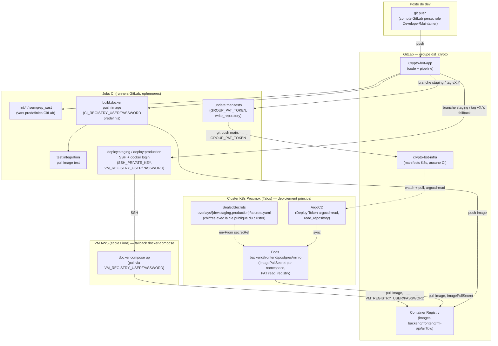

# Secrets et tokens — cartographie complète de la chaîne de déploiement

> Ce document explique **comment tout s'articule** entre le poste de dev, GitLab et les
> cibles de déploiement (cluster K8s Proxmox via ArgoCD, VM AWS en fallback), avec le nom
> exact de chaque token/variable, son scope, et où il est configuré. Objectif : pouvoir
> tout refaire à froid sans deviner.
>
> **Aucune valeur de secret n'est reproduite ici** — uniquement des noms, scopes et
> emplacements. Consulter directement GitLab (Settings → CI/CD → Variables /
> Settings → Repository → Deploy tokens) pour les valeurs.

---

## 1. Schéma d'ensemble



**Point clé** : le déploiement **principal** est GitOps *pull-based* — la CI ne déploie
jamais directement sur le cluster. Elle met à jour un tag d'image + une annotation dans
`crypto-bot-infra` (`update:manifests`), et c'est **ArgoCD** (qui tourne dans le cluster)
qui détecte le changement et synchronise. La VM AWS est un chemin de secours parallèle
(`deploy:staging`/`deploy:production`), indépendant d'ArgoCD.

**Asymétrie volontaire (2026-07-22, corrigée 2026-07-23)** : le cluster K8s fait tourner
`backend`/`frontend`/`postgres`/`minio` (`base/kustomization.yaml` liste ces 4 ressources).
`ml-api`/`mlflow-ui` (ajoutés le 2026-07-21) et `airflow` (ajouté le 2026-07-22) n'existent
que côté VM AWS (`docker-compose.staging.yml`/`docker-compose.prod.yml` dans
`crypto-bot-app`) — aucun manifest K8s équivalent n'a été créé pour eux. Ce n'est pas un
oubli de cette session, mais un choix de scope pas encore comblé : si ces services doivent
un jour tourner sur K8s aussi, il faudra ajouter `base/ml-api/`, `base/mlflow-ui/`,
`base/airflow/` (+ overlays) dans ce repo, à l'identique du pattern existant pour
`backend`/`frontend`/`postgres`/`minio`.

---

## 2. Tableau des tokens et variables

| Nom | Type | Scope | Où configuré | Usage |
|---|---|---|---|---|
| `GROUP_PAT_TOKEN` | PAT personnel | `write_repository` | Groupe `dst_crypto` → CI/CD Variables | `update:manifests` : push des tags d'image dans `crypto-bot-infra` |
| `SSH_PRIVATE_KEY` | Clé SSH privée | — | Groupe `dst_crypto` → CI/CD Variables | Connexion à la VM AWS depuis `deploy:staging`/`deploy:production` |
| `SSH_USER` | Variable texte | — | Groupe `dst_crypto` → CI/CD Variables | Utilisateur SSH sur la VM |
| `VM_HOST` | Variable texte | — | Groupe `dst_crypto` → CI/CD Variables | IP/hostname de la VM AWS |
| `VM_REGISTRY_USER` / `VM_REGISTRY_PASSWORD` | Deploy Token | `read_registry` | Groupe `dst_crypto` → CI/CD Variables | `docker login` **depuis la VM** (persiste au-delà de la durée d'un job CI, contrairement aux variables prédéfinies GitLab) |
| `CI_REGISTRY_USER` / `CI_REGISTRY_PASSWORD` | — (prédéfinies GitLab) | job-scoped, éphémères | Automatique (Container Registry activé) | `docker login` **dans les jobs CI** (`build:docker` push, `test:integration`/`scan:images` pull) — **ne jamais redéfinir manuellement avec ces noms exacts**, ça écrase les valeurs automatiques |
| `argocd-read` | Deploy Token (repo `crypto-bot-infra`) | `read_repository` | Enregistré dans ArgoCD via `argocd repo add` | ArgoCD lit `crypto-bot-infra` pour détecter les changements de manifests |
| ImagePullSecret (par namespace `dev`/`staging`/`production`) | PAT personnel | `read_registry` | `kubectl create secret docker-registry` dans chaque namespace | Les pods K8s pull les images depuis le Container Registry GitLab privé |
| `k8s-registry-pull` | Deploy Token (groupe) | `read_registry` | Groupe `dst_crypto` → Deploy tokens | Disponible pour un usage futur/alternatif de pull registre côté K8s |

**Distinction importante** : les identifiants "registre" existent sous **3 formes différentes** selon le contexte d'exécution — variables prédéfinies GitLab (jobs CI), Deploy Token dédié VM (`VM_REGISTRY_USER/PASSWORD`), et PAT dédié K8s (ImagePullSecret). Ne pas les confondre ni les fusionner : chacun a une durée de vie et un usage propres.

---

## 3. Reproduire la chaîne à froid — guide pas à pas

### 3.1 Accès GitLab (poste de dev)
1. Compte GitLab avec rôle **Developer** minimum sur `crypto-bot-app` et `crypto-bot-infra` (Maintainer pour gérer les tokens/variables).
2. Clé SSH personnelle ajoutée sur son profil GitLab pour `git push`.

### 3.2 Pipeline CI (`crypto-bot-app`)
1. Activer le **Container Registry** du projet (Settings → General → Visibility) — active automatiquement `CI_REGISTRY_USER`/`CI_REGISTRY_PASSWORD` dans les jobs.
2. Créer `GROUP_PAT_TOKEN` : profil GitLab d'un compte dédié → Access Tokens → scope `write_repository` → coller dans Groupe `dst_crypto` → CI/CD Variables.
3. Créer un Deploy Token pour la VM : `crypto-bot-app` (ou groupe) → Settings → Repository → Deploy tokens → scope `read_registry` uniquement → username+token dans `VM_REGISTRY_USER`/`VM_REGISTRY_PASSWORD` (variables groupe).
4. `SSH_PRIVATE_KEY`/`SSH_USER`/`VM_HOST` : clé SSH dédiée au déploiement (pas une clé personnelle), autorisée sur la VM cible.

### 3.3 ArgoCD (cluster K8s)
1. Installer ArgoCD dans le cluster (`kubectl apply` des manifests officiels).
2. Créer un Deploy Token scope `read_repository` sur `crypto-bot-infra` (ou réutiliser `argocd-read` au niveau groupe).
3. `argocd repo add https://gitlab.com/dst_crypto/crypto-bot-infra.git --username gitlab-ci-token --password <deploy-token>`
4. `kubectl apply -f argocd/staging-app.yaml` et `argocd/production-app.yaml`.

### 3.4 ImagePullSecret (par namespace)
Pour chaque namespace (`dev`, `staging`, `production`) :
```bash
kubectl create secret docker-registry gitlab-registry-pull \
  --docker-server=registry.gitlab.com \
  --docker-username=<PAT_username> \
  --docker-password=<PAT_token> \
  --namespace=<namespace>
```
Le PAT doit avoir le scope `read_registry`.

### 3.5 Sealed Secrets applicatifs (`crypto-bot-secrets`)
Voir section 4 ci-dessous — spécifique à `EXCHANGE_ENC_KEY` et aux autres secrets applicatifs.

---

## 4. EXCHANGE_ENC_KEY — génération et scellement par environnement

`EXCHANGE_ENC_KEY` est la clé AES-256 (32 octets, encodée base64) qui chiffre les clés API
exchange des utilisateurs stockées en base (`user_settings.api_keys`, cf.
`backend/src/shared/config/security.py` dans `crypto-bot-app`). Elle fait partie du même
Secret Kubernetes (`crypto-bot-secrets`) que les autres secrets applicatifs
(`POSTGRES_PWD`, `MINIO_ACCESS_KEY`, `MINIO_SECRET_KEY`, `SECRET_KEY`) — le déploiement
backend l'injecte via `envFrom: secretRef` (aucun mapping individuel dans
`base/backend/deployment.yaml`).

### 4.1 Cas staging / production — utiliser `rotate_secrets.sh`

Le script gère la génération, le scellement, l'application et la vérification en une
seule commande (POSTGRES_PWD est aussi appliqué en direct via `ALTER USER`) :

```bash
./scripts/rotate_secrets.sh staging     # ou production
```

⚠️ Ce script **régénère tous les secrets applicatifs en même temps** (pas seulement
`EXCHANGE_ENC_KEY`) et redémarre MinIO + le backend. Si des clés API utilisateur sont déjà
stockées en base, elles deviennent illisibles après cette opération (aucune re-encryption
automatique) — à ne lancer que si la base est vide ou si la perte est acceptée.

### 4.2 Cas dev — pas couvert par le script (à faire manuellement)

`rotate_secrets.sh` ne supporte que `staging`/`production`. Pour `dev` (ou tout namespace
neuf sans le script) :

```bash
NAMESPACE=dev

# 1. Generer la valeur (jamais affichee dans le terminal si on evite un echo separe)
# 2. Construire un Secret K8s en clair dans un fichier temporaire
cat > /tmp/secret-plain.yaml <<EOF
apiVersion: v1
kind: Secret
metadata:
  name: crypto-bot-secrets
  namespace: $NAMESPACE
type: Opaque
stringData:
  EXCHANGE_ENC_KEY: "$(openssl rand -base64 32)"
  # ... + les autres cles (POSTGRES_PWD, MINIO_ACCESS_KEY, MINIO_SECRET_KEY, SECRET_KEY)
EOF

# 3. Sceller avec kubeseal (utilise la cle publique du cluster courant)
kubeseal --controller-namespace kube-system --format yaml \
  < /tmp/secret-plain.yaml > overlays/$NAMESPACE/secrets.yaml

# 4. Nettoyer le fichier en clair immediatement
rm -f /tmp/secret-plain.yaml

# 5. Appliquer au cluster
kubectl apply -f overlays/$NAMESPACE/secrets.yaml

# 6. Redemarrer le backend pour qu'il relise la nouvelle valeur
kubectl rollout restart deployment/crypto-bot-backend -n $NAMESPACE
```

Le fichier `overlays/$NAMESPACE/secrets.yaml` résultant contient uniquement des données
**chiffrées** (safe à commiter dans Git) — c'est tout l'intérêt de Sealed Secrets : seul le
controller du cluster cible peut le déchiffrer.

### 4.3 Pourquoi on ne peut pas juste renommer `BINANCE_ENC_KEY` → `EXCHANGE_ENC_KEY` dans le YAML

Chaque `encryptedData.<CLE>` d'un SealedSecret est produit par un chiffrement asymétrique
dont le contexte (AAD) dépend du scope choisi (`strict` par défaut : `namespace/name` du
Secret cible). Renommer uniquement le champ YAML sans re-sceller **peut** fonctionner selon
le scope, mais ce n'est pas garanti sans test — voir §4.2 pour la méthode fiable
(régénération complète), qui a l'avantage de ne dépendre d'aucune hypothèse sur le
comportement exact du controller installé.

---

## 5. Points de vigilance identifiés (2026-07-22)

- **Conflit de nommage résolu** : `CI_REGISTRY_USER`/`CI_REGISTRY_PASSWORD` avaient été
  créées manuellement au niveau groupe avec un Deploy Token `read_registry` — ces noms
  entrent en collision avec les variables prédéfinies de GitLab (utilisées par
  `build:docker` pour le *push*, qui a besoin de `write_registry`). Renommées en
  `VM_REGISTRY_USER`/`VM_REGISTRY_PASSWORD` côté `.gitlab-ci.yml` (`crypto-bot-app`,
  jobs `deploy:staging`/`deploy:production` uniquement) pour lever l'ambiguïté.
- **Deploy Token `k8s-pull` expiré** depuis le 2026-02-21 (scope `read_registry`) — à
  révoquer si plus utilisé (remplacé par `k8s-registry-pull`, valide jusqu'en 2027-04).
- **Namespace `dev` désynchronisé** : le Secret live dans le cluster contient encore
  `MONGODB_PWD`/`MONGODB_USER` (retirés du code applicatif depuis) et n'a pas
  `BINANCE_ENC_KEY`/`EXCHANGE_ENC_KEY` du tout, alors que `overlays/dev/secrets.yaml`
  (Git) définit `BINANCE_ENC_KEY` sans les champs Mongo — le manifeste et l'état réel du
  cluster ont dérivé l'un de l'autre. À resynchroniser (régénération complète via §4.2)
  plutôt que de corriger un champ isolément.
- **Rotation de `SSH_PRIVATE_KEY`** : en attente — la VM cible est une ressource de l'école
  Liora, à vérifier auprès de l'encadrant avant toute rotation autonome.
