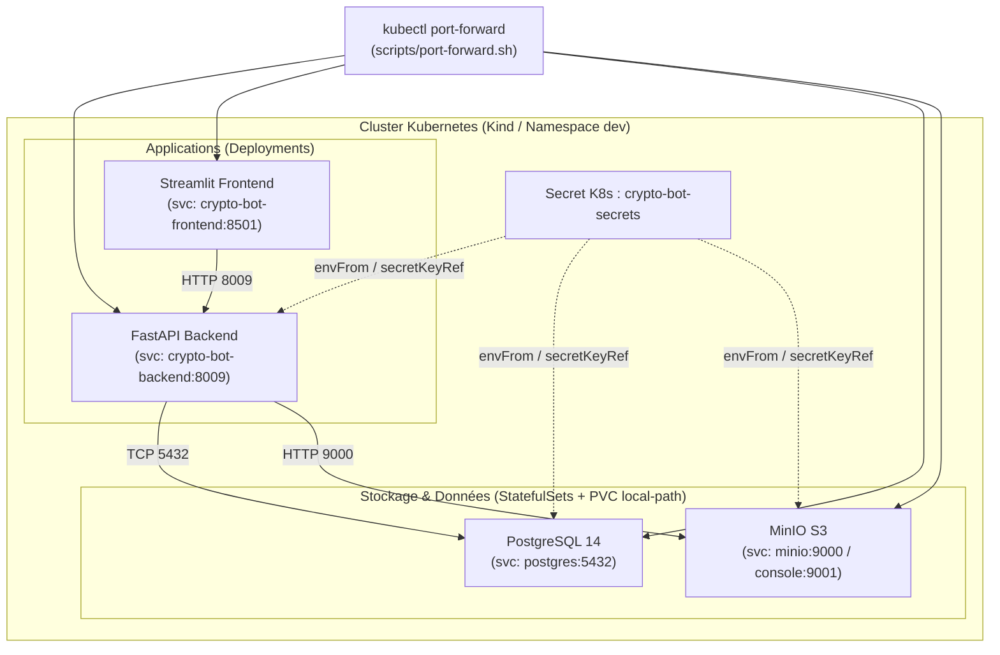

# Déploiement de l'Infrastructure Kubernetes sur Kind en Local

Ce document présente l'analyse technique et le guide pratique pour déployer l'infrastructure du projet **`crypto-bot-infra`** sur un cluster **Kubernetes local provisionné avec Kind** (`kind-control-plane v1.36.1`), en complément ou en alternative à Docker Compose.

---

## 1. Contexte & Périmètre

### Architecture applicative dans Kubernetes
Le dépôt [crypto-bot-infra](https://gitlab.com/dst_crypto/crypto-bot-infra) définit les manifests Kubernetes pour les 4 composants applicatifs socles :

#### Rendu Mermaid


#### Équivalent texte ASCII
```text
+---------------------------------------------------------------------------------------+
|                       Cluster Kubernetes (Kind / Namespace: dev)                      |
|                                                                                       |
|  +---------------------------------------------------------------------------------+  |
|  |                 Secret K8s : crypto-bot-secrets (DB, MinIO, Clés)               |  |
|  +---------------------------------------------------------------------------------+  |
|          :                                   :                               :        |
|          : (envFrom / secretKeyRef)          : (envFrom / secretKeyRef)      :        |
|          v                                   v                               v        |
|  +-----------------------+         +-----------------------+     +-----------------+  |
|  |     StatefulSet       |         |      StatefulSet      |     |   Deployment    |  |
|  |    PostgreSQL 14      |         |       MinIO S3        |     | FastAPI Backend |  |
|  | (svc: postgres:5432)  |<--------+ (svc: minio:9000/9001)|<----+ (backend:8009)  |  |
|  |   [PVC: local-path]   | TCP 5432|   [PVC: local-path]   |HTTP |                 |  |
|  +-----------------------+         +-----------------------+     +--------+--------+  |
|                                                                           ^           |
|                                                                           | HTTP 8009 |
|                                                                  +--------+--------+  |
|                                                                  |   Deployment    |  |
|                                                                  |Streamlit Frontend| |
|                                                                  | (frontend:8501) |  |
|                                                                  +--------+--------+  |
+---------------------------------------------------------------------------|-----------+
                                                                            |
                         Accès local via kubectl port-forward               |
  --------------------------------------------------------------------------|------------
       [localhost:5442]   <------------->  (svc: postgres:5432)             |
       [localhost:9020/21]<------------->  (svc: minio:9000 / console:9001) |
       [localhost:8019]   <------------->  (svc: crypto-bot-backend:8009)---+
       [localhost:8511]   <------------->  (svc: crypto-bot-frontend:8501)
```

> [!NOTE]
> **Airflow et MLflow** ne sont pas dans `crypto-bot-infra` (ils sont gérés séparément sur VM ou via Docker Compose). Seuls PostgreSQL, MinIO, le Backend FastAPI et le Frontend Streamlit sont orchestrés par Kubernetes.

---

## 2. Analyse Comparative : Cluster Proxmox vs Kind Local

Les manifests du dépôt ont été initialement conçus pour un cluster distant (Proxmox / Talos) géré via ArgoCD et GitLab CI. Voici les adaptations requises pour tourner sur Kind :

| Composant | Cluster distant (Proxmox / ArgoCD) | Cluster local Kind | Solution / Adaptation |
| :--- | :--- | :--- | :--- |
| **Gestion des Secrets** | `Bitnami SealedSecrets` (`overlays/dev/secrets.yaml`), chiffrés pour la clé publique du serveur Proxmox. | Kind n'a pas le contrôleur `sealed-secrets` ni la clé privée pour déchiffrer. | Créer un **`Secret` Kubernetes standard** (`crypto-bot-secrets`) avec les variables locales (`.env`). |
| **Images Docker** | `registry.gitlab.com/dst_crypto/...` nécessitant un `imagePullSecret` (`gitlab-registry`). | Échec de pull sans token GitLab valide (`ImagePullBackOff`). | **`kind load docker-image`** pour injecter directement les images Docker locales sans passer par un registre distant. |
| **Stockage persistant (PVC)** | CSI de virtualisation Proxmox/Talos. | StorageClass dynamique locale requise. | Kind intègre nativement **`local-path-storage`** (déjà configuré par défaut pour PostgreSQL 5Gi et MinIO 10Gi). |
| **Exposition réseau** | Ingress Controller NGINX + nom de domaine externe. | Pas d'Ingress Controller par défaut sur Kind. | **`kubectl port-forward`** sur une plage de ports dédiée évitant les conflits avec Docker Compose. |

---

## 3. Recommandations de Conception

1. **Ne pas écraser `overlays/dev`** :
   Conserver l'overlay `overlays/dev` intact afin qu'il reste synchronisé avec GitLab et l'infrastructure de soutenance distante.
2. **Créer un overlay dédié `overlays/local`** :
   Créer un répertoire [overlays/local](https://gitlab.com/dst_crypto/crypto-bot-infra/-/blob/main/overlays/local) qui hérite de [base/](https://gitlab.com/dst_crypto/crypto-bot-infra/-/blob/main/base) et applique :
   - Des images locales (`imagePullPolicy: IfNotPresent` au lieu de `Always`).
   - Le retrait de la dépendance à `imagePullSecrets: gitlab-registry`.
   - La génération d'un secret standard sans `SealedSecret`.
3. **Isolation des ports** :
   Utiliser la plage de ports `dev` définie dans [scripts/port-forward.sh](https://gitlab.com/dst_crypto/crypto-bot-infra/-/blob/main/scripts/port-forward.sh) pour pouvoir faire tourner simultanément Docker Compose et Kubernetes Kind sans conflit :

| Service | Port dans Docker Compose | Port K8s Kind (via port-forward) |
| :--- | :--- | :--- |
| **Frontend Streamlit** | `8501` | `8511` |
| **Backend FastAPI** | `8009` | `8019` |
| **PostgreSQL** | `5434` | `5442` |
| **MinIO API / Console** | `9000` / `9001` | `9020` / `9021` |

---

## 4. Guide de Déploiement Pas-à-Pas sur Kind

### Étape 1 : Créer le namespace
```bash
kubectl create namespace dev --dry-run=client -o yaml | kubectl apply -f -
```

### Étape 2 : Créer le Secret Kubernetes standard
Générer le secret `crypto-bot-secrets` dans le namespace `dev` à partir des valeurs locales :
```bash
kubectl create secret generic crypto-bot-secrets -n dev \
  --from-literal=POSTGRES_USER=postgres \
  --from-literal=POSTGRES_PWD=postgres \
  --from-literal=SECRET_KEY=dev_secret_key_change_in_production \
  --from-literal=JWT_SIGNING_KEY=dev_jwt_secret_key_change_in_production \
  --from-literal=MINIO_ACCESS_KEY=minioadmin \
  --from-literal=MINIO_SECRET_KEY=minioadmin \
  --from-literal=EXCHANGE_ENC_KEY=AAAAAAAAAAAAAAAAAAAAAAAAAAAAAAAAAAAAAAAAAAA= \
  --dry-run=client -o yaml | kubectl apply -f -
```

### Étape 3 : Tagger et charger les images dans Kind
Kind s'exécute dans un conteneur Docker. Pour qu'il utilise vos images locales sans tenter de les télécharger sur Internet :
```bash
# 1. Tagger les images locales construites
docker tag crypto-bot-app-crypto-bot-backend:latest crypto-bot-backend:local
docker tag crypto-bot-app-crypto-bot-frontend:latest crypto-bot-frontend:local

# 2. Injecter les images dans le nœud Kind
kind load docker-image crypto-bot-backend:local
kind load docker-image crypto-bot-frontend:local
kind load docker-image elestio/minio:latest
kind load docker-image postgres:14
```

### Étape 4 : Déployer les manifests
Appliquer les ressources Kustomize de l'overlay local (ou appliquer directement la base avec les images locales) :
```bash
kubectl apply -k overlays/local
```

### Étape 5 : Vérifier le statut des Pods et PVC
```bash
# Vérifier les Pods
kubectl get pods -n dev -o wide

# Vérifier les Volumes persistants (PVC local-path)
kubectl get pvc -n dev
```

### Étape 6 : Accéder aux services
Lancer les port-forwards :
```bash
# Frontend Streamlit (accessible sur http://localhost:8511)
kubectl port-forward -n dev svc/crypto-bot-frontend 8511:8501 &

# Backend FastAPI (accessible sur http://localhost:8019/docs)
kubectl port-forward -n dev svc/crypto-bot-backend 8019:8009 &

# MinIO Console (accessible sur http://localhost:9021)
kubectl port-forward -n dev svc/minio 9021:9001 &
```

---

## 5. Procédure de Nettoyage (Arrêt)

Pour supprimer les ressources déployées dans Kind sans affecter le reste du cluster :
```bash
# Supprimer le namespace dev et tous ses composants
kubectl delete namespace dev

# Arrêter les processus de port-forwarding en arrière-plan
pkill -f "kubectl.*port-forward.*-n dev" || true
```
